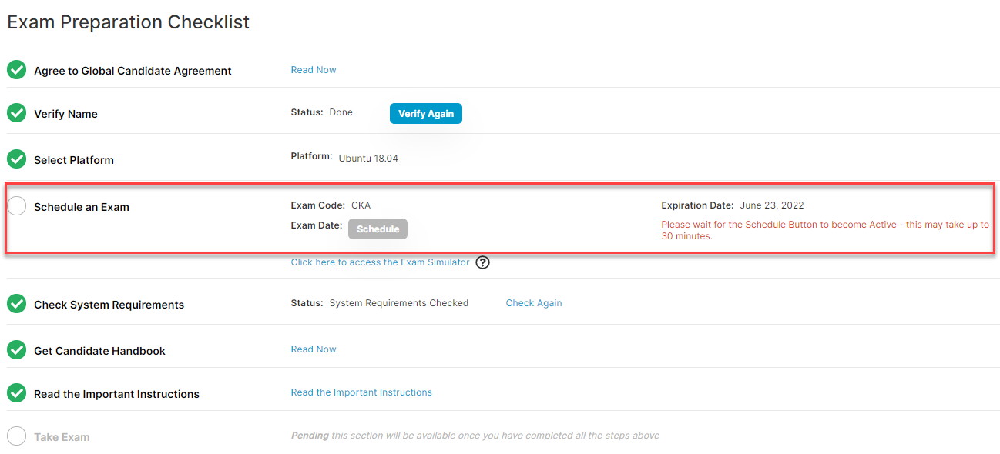
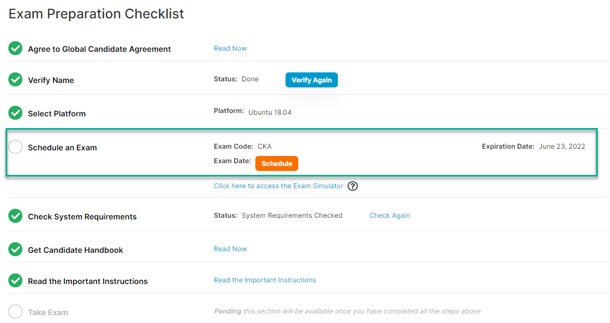
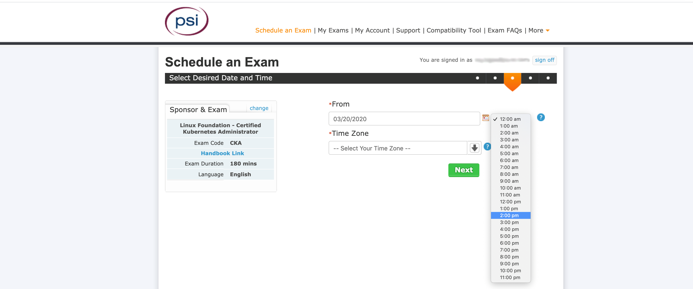
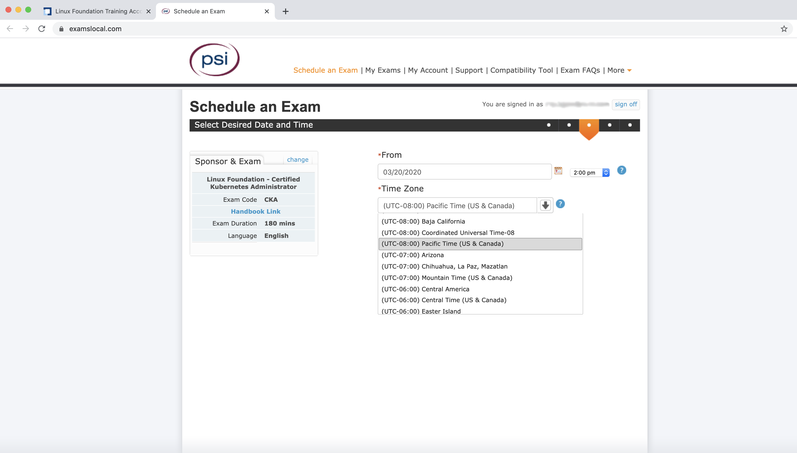
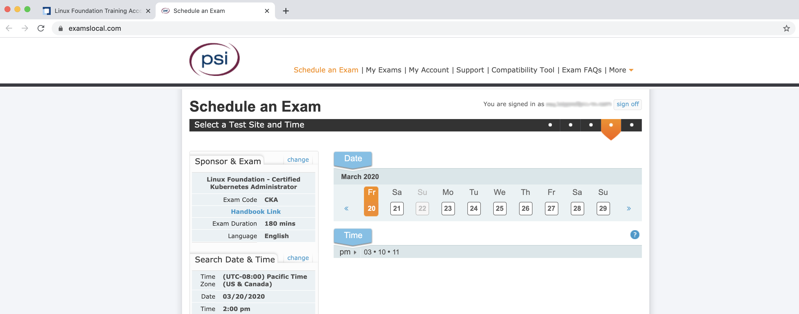
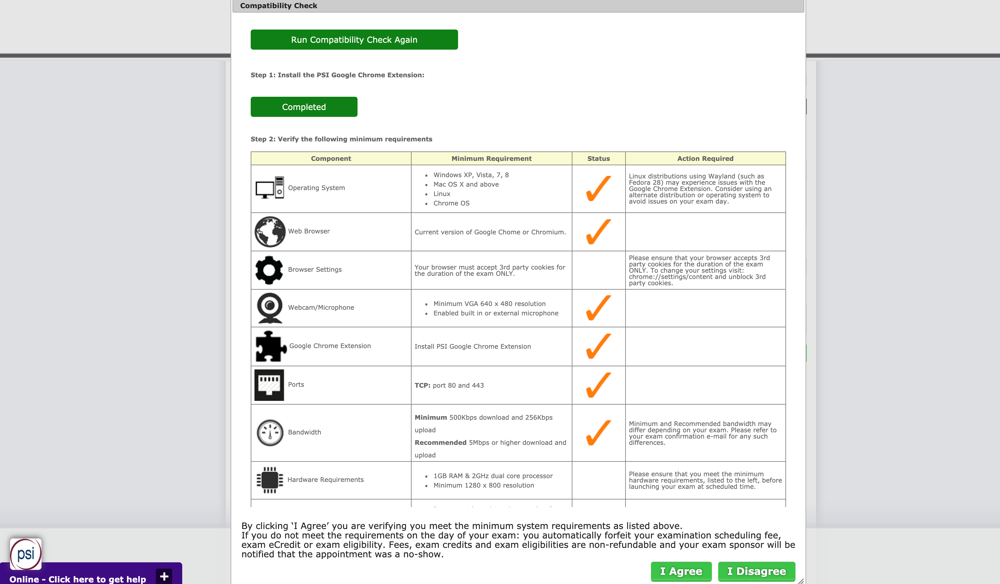
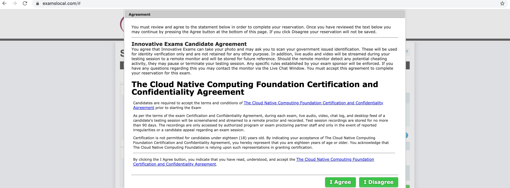
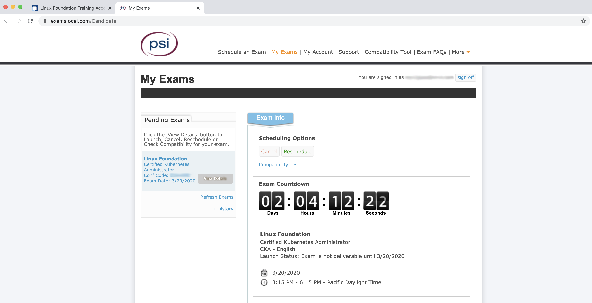

## Reviewing Your Exam Eligibility

To check your exam information, you can log in at <https://trainingportal.linuxfoundation.org/> using your LFID information. On the dashboard, find the correct certification under "In Progress" and go to "Start Certification" to reach the "Exam Preparation Checklist."

If your "Schedule" button is not active, make sure you have completed the initial steps of "Agree to the Global Candidate Agreement" and "Verify Name." You may need to wait 30 minutes for the eligibility to become active.

When you are able to select the "Schedule"  button, you will be redirected to https://www.examslocal.com/linuxfoundation.

 

## Scheduling an Exam

1. After completing the steps above, you will be redirected to <https://www.examslocal.com/>. Make sure your email is correct at the top right ("You are signed in as [your email here]") to ensure you are in the system correctly for scheduling.

2. Click on the "Schedule an Exam" link at the top.

    - If you see "Eligible Exams" at the top, you can use the "Schedule Exam" link.

    

    - If you do not see this option, search for your exam to get to the correct scheduling page.
        - "CKA" to select "Linux Foundation : Certified Kubernetes Administrator (CKA) - English"
        - "CKAD" to select "Linux Foundation : Certified Kubernetes Application Developer (CKAD) - English"
        - "CKS" to select "Linux Foundation : Certified Kubernetes Security Specialist (CKS) - English"

3. Select the desired date.

4. Select the desired time.

5. Select your time zone.

6. Select Next. The "Current Time Selected" is your local current time not the desired test time. It may take several minutes to process.

7. This page has the available test slots. It may take a few minutes to bring up the available time slots of that day.

8. Select the starting hour of the time slot (e.g. **pm** -> 1 for time slots that start between 1:00pm and 1:59pm). Please note the time slots may appear out of order or you may see duplicates - check both for your preferred time.

9. Select the Time Slot and click "Next."

10. Install the PSI Google Chrome Extension and run the compatibility check. The Browser Settings, Hardware Requirements, and Testing Environment boxes may not always show a checkmark but you review the steps to ensure your computer is in compliance.

11. Agree to the CNCF Confidentiality Agreement.

12. Confirm the reservation, noting the Cancellation Policy that you must change your exam time 24 hours ahead if you want to reschedule.

 
 

## Cancelling or Rescheduling Your Exam

Once you have an exam reservation, you can cancel or reschedule the reservation up to **24 hours before the start time of the reservation**. Reservation changes are not possible within 24 hours before the start time.

1. Login to www.examslocal.com/linuxfoundation with your Linux Foundation ID.
2. Click on the "My Exams" option at the top.
3. Click on the scheduled Exam.
   - Select the Cancel option if you want to reschedule at a later date.
       - As long as you cancel before the 24-hour deadline, you can retain your first attempt and your free retake.
       - You can follow the "Scheduling an Exam" instructions below to schedule your exam in the future.
   - Select "Reschedule" if you have a new exam date in mind. You will be prompted to choose the desired date, time, time zone, and then exam time.

